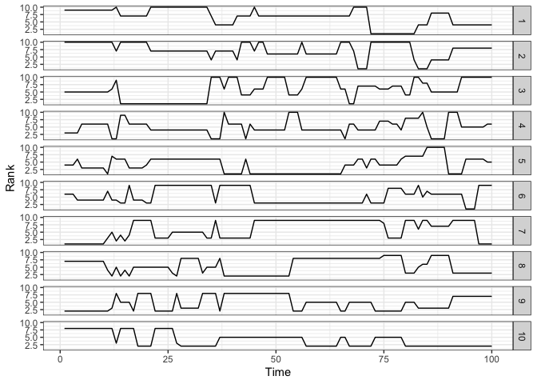
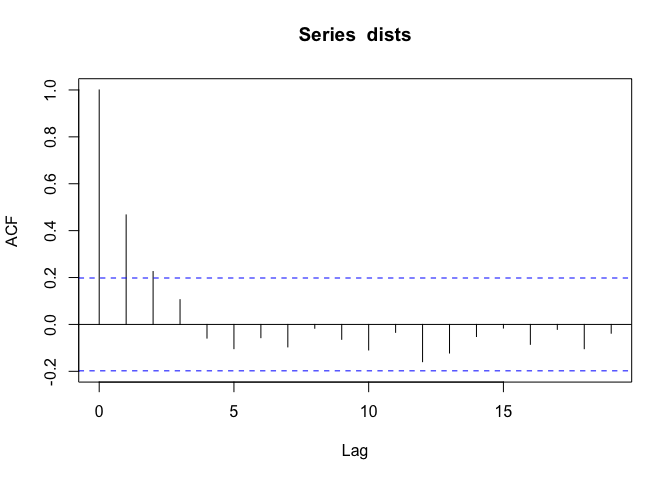
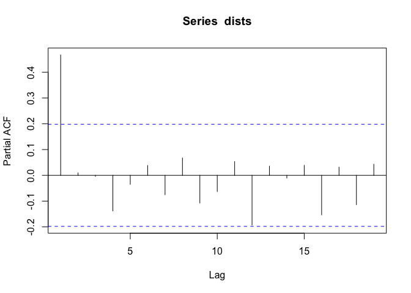
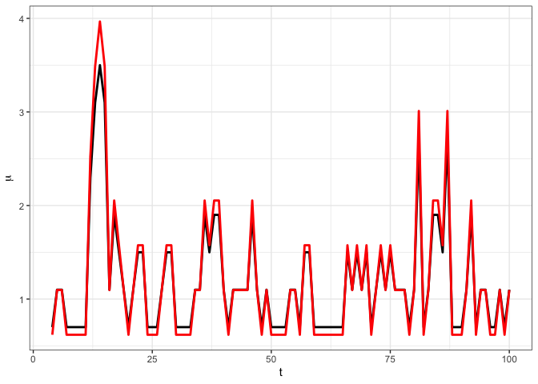

<!-- README.md is generated from README.Rmd. Please edit that file -->

``` r
library(RGARCH)
library(BayesMallows)
#> Warning: package 'BayesMallows' was built under R version 4.3.3
library(reshape2)
library(ggplot2)
#> Warning: package 'ggplot2' was built under R version 4.3.3
library(dplyr)
#> 
#> Attaching package: 'dplyr'
#> The following objects are masked from 'package:stats':
#> 
#>     filter, lag
#> The following objects are masked from 'package:base':
#> 
#>     intersect, setdiff, setequal, union
```

`rGARCH` is an R package implementing the Ranking-GARCH model of
Piancastelli and Barreto-Souza. This example demonstrates RGARCH
simulation, fitting and selection.

------------------------------------------------------------------------

## Installation

You can install the package directly from GitHub:

``` r
# Install remotes if not already installed
install.packages("remotes")

# Install myPackage from GitHub
remotes::install_github("lscpiancastelli/RGARCH")
```

\##1. Simulate Ranking Data

``` r
N = 100   # Number of time points
n = 10    # Number of items
phi0 = 0.7
phi = c(0.4)

set.seed(7)
sim = rRGARCH(N, n, phi0, phi)
```

rRGARCH() simulates ranking time series with parameters
$\phi_0, \phi, \alpha$. N = total time points, n = number of items.

Let’s visualise the simulated data by creating an orderings data frame.
This data frame will contain rank of each item per time point, which we
can then plot using ggplot2.

``` r
orderings_df = data.frame(create_ordering(sim$data))
orderings_df$t = 1:N
orderings_df = melt(orderings_df, id.vars = 't')
orderings_df$variable = gsub("X", "", orderings_df$variable)
orderings_df$variable = as.numeric(orderings_df$variable)

ggplot(orderings_df, aes(x = t, y = value)) +
  facet_grid(rows = vars(variable)) +
  geom_line() +
  theme_bw() +
  labs(x = 'Time', y = "Rank")
```



The function `lagonedist` calculates the Kendall distance between
consecutive rankings. The autocorrelation function (ACF) and partial
autocorrelation function (PACF) of this trajectory can give us an idea
of R-GARCH orders.

``` r
dists = lagonedist(sim$data)
acf(dists)
```



``` r
pacf(dists)
```



## 2. Fit RGARCH Models

We can fit RGARCH models of different orders using the `fit_RGARCH`
function. This function takes the data and the desired orders as input
and returns a fitted model object. In this example, we will perform
model selection using a sequential forward Likelihood Ratio Test (LRT)
approach, starting from the simplest model and adding parameters until
no significant improvement is observed.

``` r
# Fit RGARCH(0,0)
fit0 = fitRGARCH(sim$data, p=0, q=0)
fit0$value
#> [1] -358.2042
```

In the first iteration, we consider the candidates (1,0) and (0,1). We
fit both models and perform LRT to compare them with the null model
(0,0).

``` r
fit1_0 = fitRGARCH(sim$data, p=1, q=0)
fit0_1 = fitRGARCH(sim$data, p=0, q=1)

# Likelihood ratio tests
LRT1_0 = 2*(fit1_0$value - fit0$value)
p_value1_0 = (1 - pchisq(LRT1_0, df =1))/2

LRT0_1 = 2*(fit0_1$value - fit0$value)
p_value0_1 = (1 - pchisq(LRT0_1, df =1))/2

c(p_value1_0, p_value0_1)
#> [1] 1.301776e-08 2.568081e-02
c(LRT1_0, LRT0_1) #Add p
#> [1] 30.982577  3.796442
```

The fit with highest LRT statistic is selected for the next iteration,
provided its p-value is below the significance threshold (e.g., 0.05).
In this example, we choose (1,0).

``` r
fit1_1 = fitRGARCH(sim$data, p=1, q=1)

fit2_0 = fitRGARCH(sim$data, p=2, q=0)

LRT1_1 = 2*(fit1_1$value - fit1_0$value)
p_value1_1 = (1 - pchisq(LRT1_1, df =1))/2

LRT2_0 = 2*(fit2_0$value - fit1_0$value)
p_value2_0 = (1 - pchisq(LRT2_0, df =1))/2

c(p_value1_1, p_value2_0) #No more terms
#> [1] 0.4503841 0.1343456
c(LRT1_1, LRT2_0) 
#> [1] 0.01554784 1.22341699
```

The second iteration compares the orders (1,1) and (2,0) to (1,0). The
selection stops as no significant improvement is observed. The final
selected model is RGARCH(1,0).

# 3. Plot Fitted Mean Trajectory

We can then plot the fitted mean trajectory from the selected model
against the true mean trajectory used in the simulation. This allows us
to visually assess how well the model captures the underlying dynamics
of the data.

``` r
#Plot fitted mean trajectory
mu = fittedRGARCH(fit1_0)

df <- data.frame(
  t = seq_along(sim$mu),
  sim_mu = sim$mu,
  mu = mu
)

ggplot(filter(df, t>3), aes(x = t)) +
  geom_line(aes(y = sim_mu), linewidth = 1) +
  geom_line(aes(y = mu), colour = "red", linewidth = 1) +
  labs(x = "t", y = expression(mu)) +
  theme_bw()
```



The parameter estimates are also close to the true values used in the
simulation, as expected. Confidence bands can be obtained using the
Hessian matrix from the optimization output, as given below.

``` r
fit1_0$par
#> [1] 0.6186005 0.4782716

ses = sqrt(-diag(solve(fit1_0$hessian)))
cbind(fit1_0$par - 1.96*ses, fit1_0$par + 1.96*ses)
#>           [,1]      [,2]
#> [1,] 0.3798599 0.8573411
#> [2,] 0.2702567 0.6862864
```
